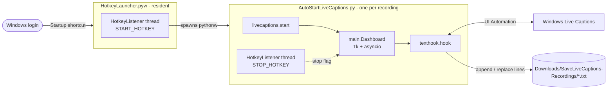

# Architecture

This page describes this personal fork. The caption capture pipeline
(`texthook`, `dedup`, `transformation`, `save`) comes from the original
[LiveCaptionsHelper/SaveLiveCaptions](https://github.com/LiveCaptionsHelper/SaveLiveCaptions).
The hotkey service, the installer, and the `livecaptions`, `hotkeys`, `winapi`
and `applog` modules were added in this fork.

## Processes

The hotkey workflow uses two processes, so that every recording starts from a
clean state and a crash in one recording never takes down the hotkey service.

| Process | Lifetime | Log |
| --- | --- | --- |
| `HotkeyLauncher.pyw` | From login until logout. A named mutex keeps it to one instance. | `logs/launcher.log` |
| `AutoStartLiveCaptions.py` | One recording. Exits after stop. The launcher starts at most one at a time. | `logs/recorder.log` |

Both run under `pythonw.exe`, which has no console. `function.applog`
redirects `print()` output and tracebacks into the log files, so background
problems stay visible.

## Modules (`src/`)

| Module | Responsibility |
| --- | --- |
| `main.py` | `Dashboard`: the floating ● / ◼ window. It glues Tk and asyncio on one thread: every 10 ms Tk runs one asyncio iteration. |
| `function/config.py` | All user settings: paths, hotkeys, capture thresholds. |
| `function/livecaptions.py` | Find, start, and close the Live Captions window. Locates the `CaptionsScrollViewer` control whose `Name` is the caption text. |
| `function/texthook.py` | Capture loop: poll the caption text, split it into sentences, save stable ones, replace improved versions, flush on exit. |
| `function/dedup.py` | Sentence similarity and "better version" rules. Post-recording file cleanup in three passes. |
| `function/transformation.py` | Spoken numbers to digits ("twenty twenty six" becomes 2026) for similarity comparison. |
| `function/save.py` | Transcript file naming and line append/replace. |
| `function/hotkeys.py` | `HotkeyListener`: `RegisterHotKey` plus a dedicated message-loop thread. Parses `"win+alt+c"`. |
| `function/winapi.py` | ctypes declarations for the Win32 calls used (hotkeys, message box, mutex). |
| `function/applog.py` | Rotating log files and stdout/stderr capture under pythonw. |

## Why the hotkey listener has its own thread

`RegisterHotKey(NULL, ...)` posts `WM_HOTKEY` to the message queue of the
thread that registered it. The first version registered the stop hotkey on the
Tk thread and polled with `PeekMessage` every 50 ms. Tk's own event loop drains
the same queue and discards thread messages it does not know, so the stop
hotkey never fired. `HotkeyListener` owns a thread whose only job is a
`GetMessage` loop. Its callback sets a `threading.Event`, and the Tk loop picks
that up on its next 10 ms tick.

## Capture pipeline (texthook)

1. Wait until Live Captions creates `CaptionsScrollViewer`, which happens on the
   first caption. Waiting has no time limit: it ends when you press stop or
   close Live Captions.
2. Every 250 ms, read the full caption text and split it into sentences. The
   splitter protects URLs, e-mail addresses, domains and decimals such as `3.14`.
3. Skip incomplete sentences. If a sentence is similar to one saved in the
   last few seconds and is a better version, replace that line in the file.
4. Otherwise count how many consecutive polls the sentence has been seen. At
   `STABLE_THRESHOLD`, append it.
5. On stop, flush the pending and trailing sentences, then run
   `Deduplicator.cleanup_file`. It merges adjacent near-duplicates, drops
   sentences that are prefixes or subsets of neighbours, and removes global
   duplicates.

## Installation layout

`scripts/install.ps1` (through `install.cmd`) manages the per-user install:
`.venv`, the Startup-folder shortcut
`SaveLiveCaptions Hotkey Launcher.lnk` → `.venv\Scripts\pythonw.exe HotkeyLauncher.pyw`,
and starting or stopping the launcher. Nothing needs administrator rights.
